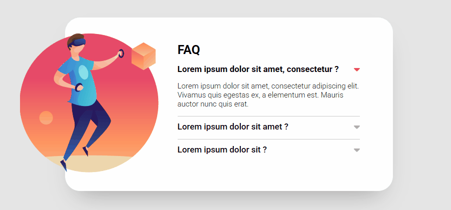

# Simple Accordion

A modern and responsive **Accordion Component** built with **HTML**, **CSS**, and **Vanilla JavaScript**. This project is perfect for FAQ sections, toggleable content blocks, or any interface where space efficiency and user interaction are key.

🔗 **Live Demo:**  
👉 [View it here](https://matheus-lmacedo.github.io/Accordion/)  
> _(Note: Replace with the actual link if different)_

---

## 🚀 Technologies Used

- **HTML5** – Semantic markup for accessible structure  
- **CSS3** – Styling, transitions, and responsive layout  
- **JavaScript (Vanilla)** – Handles toggle behavior and interactivity  

---

## 🌟 Features

- Expandable/collapsible accordion items  
- Minimal, clean, and readable codebase  
- No external libraries or dependencies

---

## 💡 Preview

### 🖥️ Design  


---

## 🛠️ Getting Started

To run the project locally:

1. **Clone the repository**:
   ```bash
   git clone https://github.com/matheus-lmacedo/Accordion.git
2. Navigate to the project folder:
   ```bash
   cd Accordion
